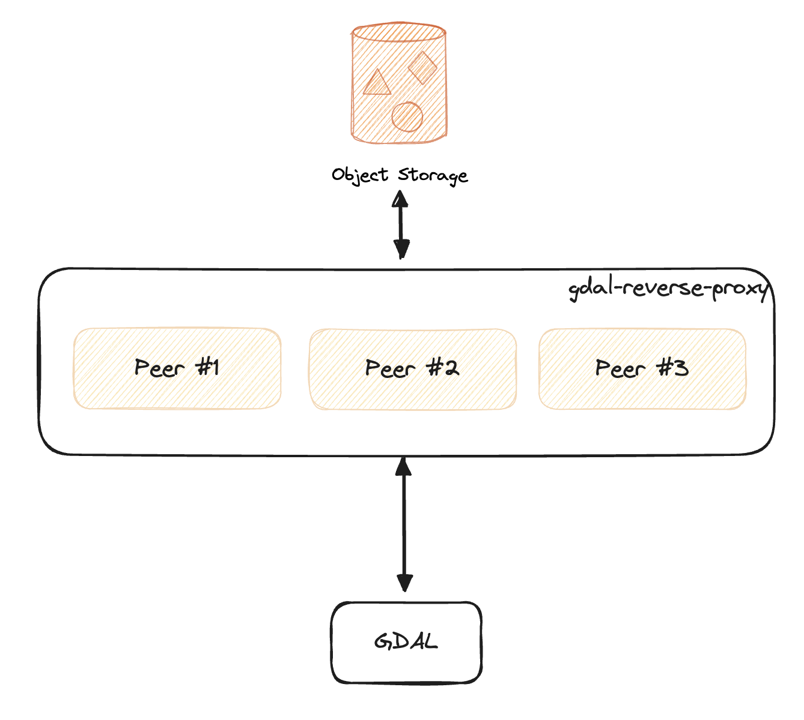

# gdal-reverse-proxy

A HTTP reverse-proxy which provides a distributed caching layer for GDAL-based applications with remote data access, ideal for cloud optimized data formats (ex. COG) which are commonly accessed via HTTP range requests.  This project uses [groupcache](https://github.com/golang/groupcache) for distributed cache filling across potentially multiple peers.  This simplifies the deployment of the cache and lets us support large cache sizes by scaling peers horizontally across potentially multiple underlying nodes.

<p align="center">
    
</p>

## Usage
Deploy the proxy with three peers and an NGINX server (`:8000`) load balancing across the peers.
```
docker compose up --build
```

Send a `gdalinfo` call to a publicly available S2 image through the proxy.  The second time running this command should be much faster than the first because the initial HTTP range request to fetch the COG header is cached by the proxy.
```
CPL_CURL_VERBOSE=YES \
GDAL_DISABLE_READDIR_ON_OPEN=TRUE \
CPL_VSIL_CURL_ALLOWED_EXTENSIONS=.tif \
gdalinfo /vsicurl/http://localhost:8000/sentinel-s2-l2a-cogs/57/C/VK/2019/11/S2B_57CVK_20191122_0_L2A/B04.tif
```

## Limitations
- `/vsicurl` only, does not support `/vsis3` or `/vsigs` (which requires HMAC key signing).
- Does not honor or forward `X-Forwarded-*` headers.
- No HTTPS on inbound requests.